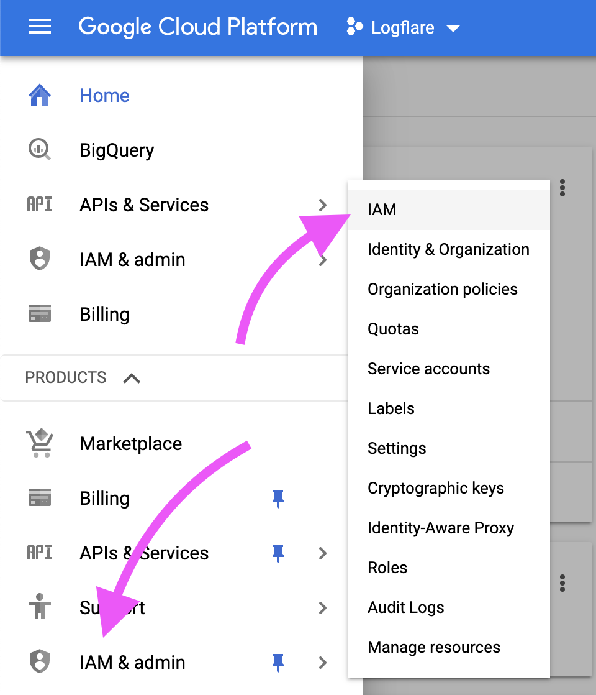
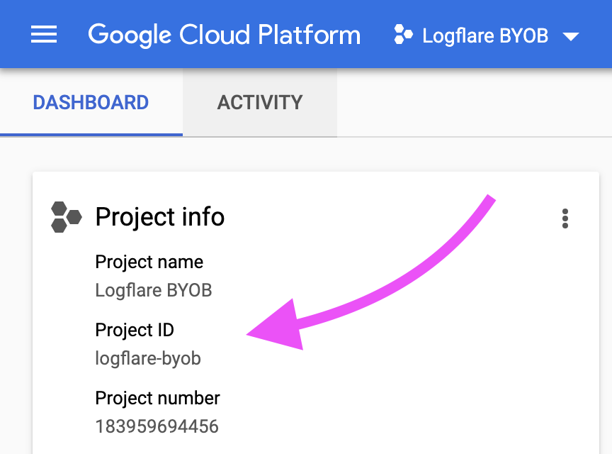
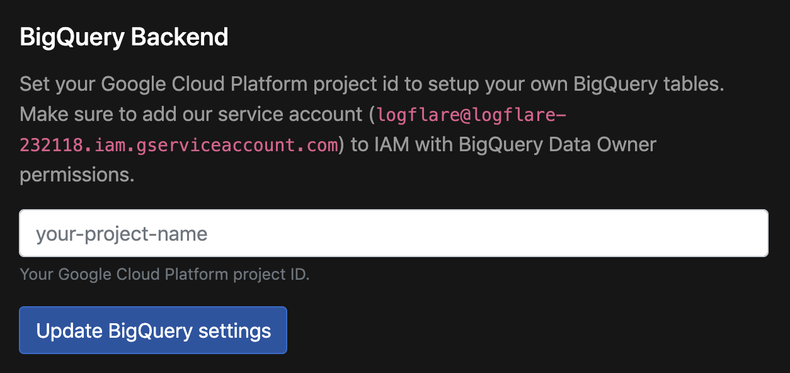

# BigQuery

Logflare natively supports the storage of log events to BigQuery. You can also Bring Your Own Backend by allowing Logflare to manage a GCP project's BigQuery.

## Setting Up Your Own BigQuery Backend

> Enable a Google Cloud Platform billing account with payment information or we won't be able to insert into your BigQuery table!

#### Step 1: Navigate to IAM and Add a Member

Navigate to `Google Cloud Platform > IAM & admin > IAM`



Then, click on the **Add** button.


#### Step 2: Add the Logflare Service Account

The Logflare service account is:

```
logflare@logflare-232118.iam.gserviceaccount.com
```

Assign `BigQuery Data Owner` and `BigQuery Job User` permissions to the Logflare service account.


#### Step 3: Update Account Settings in Logflare

Find the GCP project ID in the [dashboard](https://console.cloud.google.com/home/dashboard)



Navigate to the [account preferences](https://logflare.app/account/edit) and add in the GCP project ID.



#### Step 4 (Optional): Update Source Settings in Logflare

You can also optionally update your sources' TTL to tweak how long you want to retain log events in BigQuery.


## Querying in BigQuery

You can also directly execute SQL queries in BigQuery instead of through the Logflare UI. This would be helpful for generating reports that require aggregations, or to perform queries across multiple BigQuery tables.

### Unnesting Repeated Records

Nested columns are represeted as as repeated `RECORD`s in BigQuery. To query inside a nested record you must UNNEST it like so:

```sql
SELECT timestamp, req.url, h.cf_cache_status
FROM `your_project_id.your_dataset_name.your_table_name`,
UNNEST(metadata) m,
UNNEST(m.request) req,
UNNEST(m.response) resp,
UNNEST(resp.headers) h
WHERE DATE(timestamp) = "2019-05-09"
ORDER BY timestamp DESC
LIMIT 10
```
